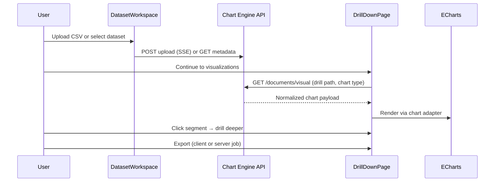

# Chart Engine Client

Modern React SPA for uploading large CSV datasets, exploring hierarchical drill-down visualizations, and exporting chart images or filtered data. Pairs with **[chart-engine-server](../chart-engine-server/README.md)** (`http://localhost:5110`).

Built with **Vite**, **React 18**, **ECharts**, and **Zustand**. All heavy analytics and tree building run on the server; the client handles UI, drill state, chart rendering, and export orchestration.

---

## Solution structure

```
chart-engine-client/
├── README.md
├── INTEGRATION.md              # Full-stack setup and smoke checklist
├── react-concepts.md           # Optional React notes
└── frontend/
    ├── package.json
    ├── vite.config.js          # Dev server + API proxy to :5110
    ├── .env.example
    └── src/
        ├── main.jsx            # App entry
        ├── App.jsx             # Router shell
        ├── config/             # VITE_* env → apiBaseUrl
        ├── router/             # Routes: /, /builder
        ├── layouts/            # App header + nav
        ├── store/              # Zustand slices (data, UI, drill, session)
        ├── services/
        │   ├── api/            # REST, SSE upload, export polling
        │   └── export/         # PNG/SVG/PDF/CSV/Excel (client-side)
        ├── components/
        │   ├── dataset-workspace/   # Upload + dataset library
        │   ├── bar-chart, pie-chart, …   # ECharts wrappers
        │   └── _shared/chartTheme.js     # Unified palette + axes
        ├── libs/
        │   ├── drill-down/     # Explore page, renderer, adapters
        │   └── chart-builder/  # Experimental builder preview
        ├── styles/             # Global tokens, DrillDown, ExploreView
        └── workers/            # Legacy csv-pipeline.worker (unused)
```

### High-level flow



---

## Application routes

| Route | Page | Description |
|-------|------|-------------|
| `/` | **Dashboard** (`DrillDownPage`) | Dataset workspace → drill-down explorer |
| `/builder` | **Chart Builder** | Server-driven chart preview (experimental) |

Navigation lives in `layouts/app-layout` (Dashboard / Chart Builder).

---

## Features

### Dataset workspace

- Drag-and-drop or browse CSV / DATA / TXT (up to **2 GB**, server-enforced)
- SSE upload progress from `POST /api/v1/documents/upload`
- Paginated dataset library with **ready** / **processing** status
- Optimistic delete (list updates immediately; background refresh syncs)
- Continue CTA with row count, drill levels, and metric summary

### Drill-down explorer

- **10 chart types:** bar, pie, line, sunburst, scatter, bubble, heatmap, correlation, multiline, histogram, plus **table** at leaf depth
- Hierarchy strip, breadcrumbs, drill-path modal, aggregation selector
- **Top chart toolbar** — changes chart type and **resets drill path** to overview
- **In-chart chart dropdown** — changes type at **current depth only**
- Server mode: `GET /api/v1/documents/visual` on path / type / aggregation changes
- Client-side formatters for histogram, scatter, correlation, sunburst tree (sample rows API where needed)

### Export

| Export | Source | UX |
|--------|--------|-----|
| PNG, SVG, PDF | Client (ECharts snapshot) | Instant |
| Chart CSV, Chart Excel | Client (series data) | Brief “building” state |
| Data CSV, Data Excel | Server job + poll + download | Toolbar status (non-blocking); buttons disabled while running |

Server exports use `POST /api/v1/datasets/{id}/export` → poll `GET .../exports/{jobId}` → download. See [INTEGRATION.md](INTEGRATION.md).

---

## Architecture

### State (Zustand)

| Slice | Responsibility |
|-------|----------------|
| **session** | `activeDatasetId`, metadata, `clearSession` |
| **data** | `serverChartData`, chart loading/error |
| **drill** | `drillPath`, `chartTypeByDepth`, `aggregation`, drill actions |
| **ui** | `isLoading`, `error`, upload progress, render timing |

### Drill-down module (`libs/drill-down`)

```
feature/drill-down-page     → workspace vs explore modes
ui/drill-down-renderer      → toolbar, export, chart routing
ui/chart-adapters/*         → map API data → chart components
hooks/useServerVisualization → fetch visual payload
hooks/useRowSampleRows      → raw rows for scatter / correlation / histogram
utils/drillDepth.js         → depth context, hierarchy steps
constants/chartOptions.jsx  → chart metadata + drill tier labels
```

### Chart components

Each chart under `components/*-chart` wraps **echarts-for-react** (SVG renderer) and imports shared styling from `components/_shared/chartTheme.js` (indigo palette, tooltips, axes, dataZoom).

### API layer (`services/api`)

| Module | Endpoints used |
|--------|----------------|
| `documents.js` | List, metadata, delete, visual, sample-rows |
| `sseUpload.js` | Multipart upload + SSE progress |
| `export.js` | Start export, poll status, download blob |
| `httpClient.js` | JSON fetch wrapper, error normalization |
| `normalizeChartData.js` | Server payload → adapter-friendly shapes |

---

## API integration (backend contract)

Base URL: `VITE_API_BASE_URL` (default in dev: `/api/v1` via Vite proxy).

| Client action | API |
|---------------|-----|
| Upload file | `POST /api/v1/documents/upload` (SSE) |
| List datasets | `GET /api/v1/documents?page=&pageSize=` |
| Dataset metadata | `GET /api/v1/documents/{id}/metadata` |
| Delete dataset | `DELETE /api/v1/documents/{id}` |
| Chart data | `GET /api/v1/documents/visual?id=&chartType=&aggregation=&drillPath=` |
| Sample rows | `GET /api/v1/documents/{id}/sample-rows` |
| Start export | `POST /api/v1/datasets/{id}/export` |
| Export status | `GET /api/v1/datasets/exports/{jobId}` |
| Download export | `GET /api/v1/datasets/exports/{jobId}/download` |

Full API details: [chart-engine-server/README.md](../chart-engine-server/README.md).

---

## Getting started

### Prerequisites

- **Node.js** 18+ (LTS recommended)
- **Chart Engine API** running at `http://localhost:5110` ([server setup](../chart-engine-server/README.md#getting-started))

### Install and run (development)

```bash
cd frontend
npm install
cp .env.example .env.development   # optional; defaults work with proxy
npm run dev
```

Open **http://localhost:5173**.

Vite proxies `/api` and `/health` to port **5110** (`vite.config.js`), so you usually do **not** need a full API URL in dev.

### Production build

```bash
cd frontend
# Set API host for static hosting (no Vite proxy):
# VITE_API_BASE_URL=http://your-api-host:5110/api/v1
npm run build
npm run preview
```

Output: `frontend/dist/`.

### Full-stack smoke test

Follow [INTEGRATION.md](INTEGRATION.md): health check → upload → bar drill → toolbar vs in-chart type change → server export.

---

## Configuration

Create `frontend/.env.development` or `frontend/.env` from `.env.example`:

| Variable | Default (dev) | Description |
|----------|-----------------|-------------|
| `VITE_API_BASE_URL` | `/api/v1` | API prefix; use full URL in production builds |
| `VITE_APP_NAME` | `Chart Engine` | Header branding |

When `VITE_API_BASE_URL` is empty, relative requests rely on the Vite proxy (dev) or same-origin deployment.

---

## Scripts

Run from `frontend/`:

| Command | Description |
|---------|-------------|
| `npm run dev` | Vite dev server (port 5173) |
| `npm run build` | Production bundle |
| `npm run preview` | Serve `dist/` locally |
| `npm run lint` | ESLint |

---

## Chart-type and drill behavior

| Control | Behavior |
|---------|----------|
| **Chart toolbar (top)** | `resetDrillAndSetChartType` — overview + new chart type |
| **Chart type dropdown (in panel)** | `setChartTypeAtDepth` — type at current level only |
| **Bar / pie / line / sunburst** | Click segment → drill into hierarchy |
| **Histogram** | Numeric bin filter (not categorical drill) |
| **Scatter / correlation** | Often view-only at server drill levels; uses row samples |
| **Table** | Aggregated bars at non-leaf; raw sample rows at max depth |

---

## Key implementation notes

- **No client-side tree build for uploads** — `workers/csv-pipeline.worker.js` is legacy; uploads go to the server only.
- **Unified chart theme** — `chartTheme.js` keeps colors and tooltips consistent across all ECharts types.
- **Bar width** — scales with category count: `max(16, min(120, 560 / barCount))`.
- **Export UX** — progress in export toolbar only (chart area is never blocked by an overlay).
- **Delete UX** — optimistic list update + `ready` count recalculated from local `items`.

---

## Documentation

| Document | Topic |
|----------|--------|
| [INTEGRATION.md](INTEGRATION.md) | API + frontend startup, smoke checklist |
| [../chart-engine-server/README.md](../chart-engine-server/README.md) | Backend API, pipelines, DB |
| [../chart-engine-server/docs/](../chart-engine-server/docs/) | Server architecture deep-dives |
| [react-concepts.md](react-concepts.md) | React patterns used in the project |

---

## Technology stack

| Area | Choice |
|------|--------|
| UI | React 18 |
| Build | Vite 8 |
| Routing | React Router 7 |
| State | Zustand 4 |
| Charts | Apache ECharts 5, echarts-for-react (SVG) |
| Icons | Lucide React |
| Client export | jsPDF, ExcelJS (dynamic import) |
| Styling | CSS modules / component CSS + design tokens (`styles/index.css`) |

---

## License

See repository license terms (if applicable).
